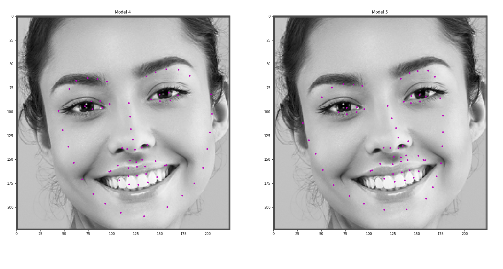

# Facial Keypoint Detection



This project is about defining and training a convolutional neural network to perform facial keypoint detection, and using computer vision techniques to transform images of faces.

This project is directly inspired by the @Udacity Computer Vision Nanodegree and has been modified in my way in <a href="https://pytorch.org/get-started/locally/">Pytorch</a>.

## File Description
- scripts/custom_dataset.py: Create the dataset using the Dataset class from Pytorch
- Notebook_PDF/inference.pdf:PDF version of the Notebook for inference
- scripts/network.py: Create the architecture of the CNN according to <a href="https://arxiv.org/pdf/1710.00977.pdf">this paper</a>
- scripts/training.py: train CNN
- scritps/helper.py: helper function to visualize batches
- scritps/load_data.py: split data into train, val then create data loaders
- scritps/transformation.py: Python file that contains all classes to transform the data (images and keypoints)

## Pipeline

### Customized Dataset
In the python file scripts/custom_dataset.py, you'll find how to custom a dataset in Pytorch. As the <a href="https://pytorch.org/docs/stable/_modules/torch/utils/data/dataset.html">documentation of the Dataset Class</a> said, we have to override `__len__` and `__getitem__`  
```
class FacialKeypointsDataset(Dataset):
    """Face Landmarks dataset."""

    def __init__(self, csv_file, root_dir, transform=None):
        pass

    def __len__(self):
        pass

    def __getitem__(self, idx):
        pass
```

### Preprocessing/Transform (Images and Keypoints)
Overview of scripts/transformation.py with the necessary transformation to apply on each images and labels before they fed in the CNN
```
class Normalize(object):
    """Convert a color image to grayscale and normalize the color range to [0,1]."""        
    pass

class Rescale(object):
    """Rescale the image in a sample to a given size.  

    Args:  
        output_size (tuple or int): Desired output size. If tuple, output is  
        matched to output_size. If int, smaller of image edges is matched  
        to output_size keeping aspect ratio the same.  
    """
    pass  

class RandomCrop(object):
    """Crop randomly the image in a sample.

    Args:
        output_size (tuple or int): Desired output size. If int, square crop
            is made.
    """
    pass


class ToTensor(object):
    pass

```

### Prepare Validation and Load Data
In the scripts/load_data.py file you'll find the functions to split, load and transform the data.  
Here is a overview
```
def create_dataset(csv_file, root_dir):
    print('Creating dataset ...')
    transform = transforms.Compose([
        Rescale(256),
        RandomCrop(224),
        Normalize(),
        ToTensor()
    ])
    
    train_set = FacialKeypointsDataset(csv_file=csv_file,
                                       root_dir=root_dir,
                                       transform=transform)
    return train_set

def train_valid_split(training_set, validation_size):
        pass
      

def build_lodaers(train_set, train_sampler, valid_sampler, batch_size, valid_size, num_workers, csv_file, root_dir):
    pass
```

### Build the CNN Architecture
```
class Net(nn.Module):

    def __init__(self):
        super(Net, self).__init__() 
        pass 
        
    def forward(self, x):
        pass
```

### Train
```
def train(n_epochs, train_loader, valid_loader, save_location_path):
    pass

def main():
    #Call all the previous classes and functions
    
if __name__=='__main__':
    main()
```

### Inference
The Inference consist in finding the ROI (Region of interest) in my case (the face) using opencv cascad file for face detection, crop the ROI then feed to the model

### Other
The model was trained on <a href="https://colab.research.google.com/notebooks/welcome.ipynb#recent=true">Google Colab</a>. It can be largely improved. I've based my approach of this case on <a href="https://arxiv.org/pdf/1710.00977.pdf">this paper</a>. 

## Authors
Medhy Vinceslas

## License
LICENSE: This project is licensed under the terms of the MIT license.

## Acknowledgement
Thank you to the @udacity staff for giving me the opportunity to improve my skills in Computer Vision.
